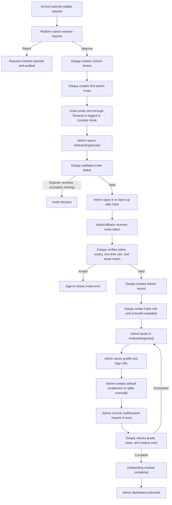

# Edujay School Onboarding Flow

Edujay uses an assisted self-serve onboarding flow. A school can request access
publicly, but a platform admin must approve the request before Edujay creates a
real tenant. This keeps production data clean and protects sensitive school,
student, finance, attendance, and results data.

## Flow Chart



## Step-By-Step Explanation

1. **School requests access**
   The public waitlist captures the school name, contact person, work email,
   role, and message. This does not create a live school tenant yet.

2. **Platform admin reviews**
   A platform admin opens `/platform/onboarding`. This role manages Edujay
   itself, not a single school. The platform admin can approve or reject the
   request.

3. **Approval creates the tenant**
   Approval creates a `School` record with a unique `schoolId` and slug. This
   `schoolId` becomes the ownership boundary for classes, students, teachers,
   finance, attendance, results, and future records.

4. **First-admin invite is generated**
   Edujay creates a `SchoolInvite` with a one-time token. The raw token is shown
   once and sent by email. Only the hashed token is stored in the database.

5. **Invite email is delivered**
   In production, Resend sends the invite when `RESEND_API_KEY` is configured.
   In development, the email is logged to the server console so local work stays
   safe.

6. **Admin accepts invite**
   The invite page checks that the invite exists, is not expired, is not revoked,
   and has not already been accepted.

7. **Clerk verifies identity**
   The admin signs in or signs up through Clerk. Edujay then verifies that the
   signed-in Clerk email matches the email on the invite.

8. **Edujay links the account**
   Edujay creates the first local `Admin` record, links it to the new school,
   and writes Clerk public metadata with `role: "admin"` and the correct
   `schoolId`.

9. **Setup wizard opens**
   The admin lands on `/onboarding/setup`, where they save school profile
   details, add a logo URL, create default academics, and record imports.

10. **Dashboard unlocks**
    Edujay only marks onboarding complete after at least one grade, class, and
    subject exist. Until then, admins are routed back to the setup wizard.

## Production Configuration

Set these variables before production email delivery:

```bash
RESEND_API_KEY=...
EMAIL_FROM="Edujay <onboarding@yourdomain.com>"
NEXT_PUBLIC_APP_URL="https://your-edujay-domain.com"
```

Without `RESEND_API_KEY`, Edujay logs onboarding emails to the server console.
